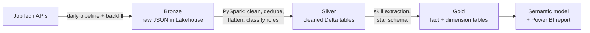

# platsbanken-data-jobs

**What skills does the Swedish job market ask for in data roles, and how has that changed over time?**

An end-to-end data engineering project that ingests job ads from Platsbanken (the Swedish Public Employment Service's job board), classifies them into data roles, extracts requested skills from the ad text, and serves the result as a Power BI report. Built in Microsoft Fabric.

> 🚧 **Status:** Work in progress. Historical backfill to the bronze layer is done; the silver layer is next.

## Questions

1. How has demand for data engineers, data scientists, data analysts and BI developers developed since 2016?
2. Which tools and skills (SQL, Python, Power BI, Azure, Fabric, SAS, Spark …) are requested for each role, and how do the roles differ?
3. Where in Sweden are the jobs, and how long do ads stay open?

## Data sources

All data comes from [JobTech Development](https://jobtechdev.se), Arbetsförmedlingen's open data platform.

| Source | Used for |
|---|---|
| **Historical Ads API** | One-off backfill of all ads for the selected roles, 2016 onwards |
| **JobSearch / JobStream API** | Daily incremental load of new and removed ads |
| **JobAd Enrichments API** *(planned)* | Extracting requested skills from free-text ad descriptions |

## Architecture (planned)

- **Bronze:** raw API responses stored unchanged, so transformations can be re-run without re-fetching.
- **Silver:** deduplicated ads with a consistent schema and a role classification.
- **Gold:** star schema with one fact row per ad, dimensions for date, region, occupation, employer and employment type, and a bridge table linking ads to skills.

## Findings from exploration so far

See [`exploration/01_utforskning_jobtech_api.ipynb`](exploration/01_utforskning_jobtech_api.ipynb).

- **Skills must be extracted from free text.** The structured `must_have.skills` and `nice_to_have.skills` fields were empty in every ad sampled, so skill extraction from the description text is a core part of the pipeline.
- **Occupation codes alone are not enough to define a role.** For searches on "data engineer", only about half of the matching ads carried the occupation label *Dataingenjör*; the rest were spread over labels such as systems developer, data warehouse specialist and database developer. BI developer has no dedicated occupation code at all. Roles will therefore be classified with a rule combining occupation code and ad title.
- **The searchable history starts in 2016.** Yearly counts return zero for 2012–2015, so the time series starts in 2016.
- **Possible break in the series:** "dataanalytiker" matches jumped from 176 in 2025 to 420 in January–September 2026. This may reflect a change in how ads are classified rather than a real shift in demand, and needs checking before drawing conclusions.
- **Duplicates across staffing agencies:** the same assignment can appear in several ads from different agencies, which the deduplication step needs to handle.

## Design decisions

- **Fetch broadly, filter late.** Bronze keeps everything fetched; role scoping happens in Silver so the definition can change without re-ingesting data.
- **Monthly windows for the backfill** keep each API request small and avoid pagination limits.
- **Schema evolution:** newer ads include fields (e.g. `workplace_model`) that older ads lack, so the pipeline must tolerate missing fields.

## Limitations

Platsbanken does not cover the whole job market. Many tech roles are advertised only on LinkedIn or company career pages, so results describe demand *as seen in Platsbanken*, not the full market.

## Roadmap

- [x] Explore JobSearch and Historical Ads APIs
- [x] Set up Fabric workspace and bronze lakehouse (Git sync is disabled in the school's Fabric tenant, so notebooks are exported to [`fabric/`](fabric/))
- [x] Bronze: historical backfill 2016–2026 (7 search terms, 896 monthly files, 16,458 ads incl. overlap between terms)
- [ ] Bronze: daily incremental ingestion
- [x] Silver: cleaning, deduplication, role classification (13,380 unique ads → 11,718 classified into five roles)
- [ ] Skill extraction (JobAd Enrichments vs. keyword matching)
- [ ] Gold: star schema
- [ ] Power BI report
- [ ] Data quality checks and documentation

## Author

**Nils af Petersens** · Data Analytics & Statistics (Linköping University) · Behavioral Science (Uppsala University)
